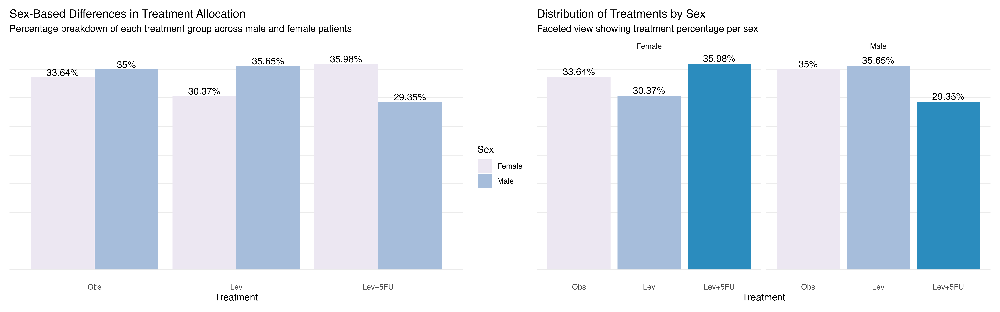
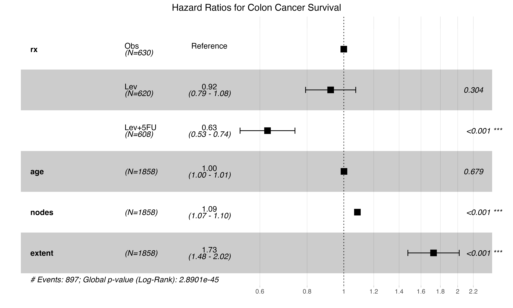
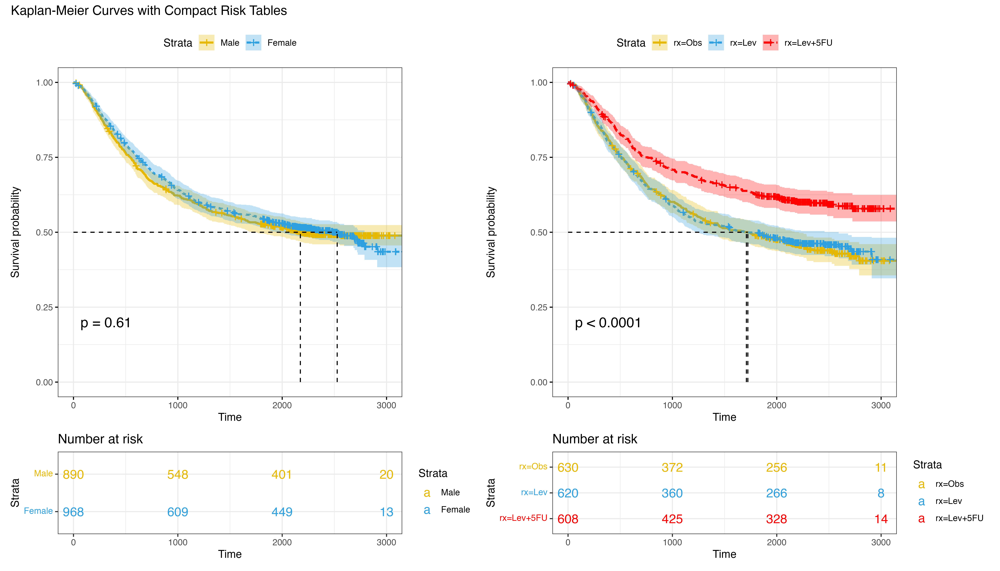
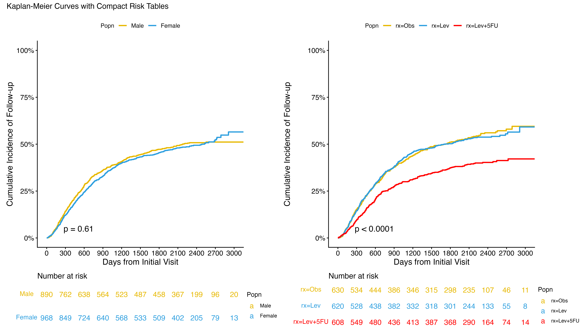
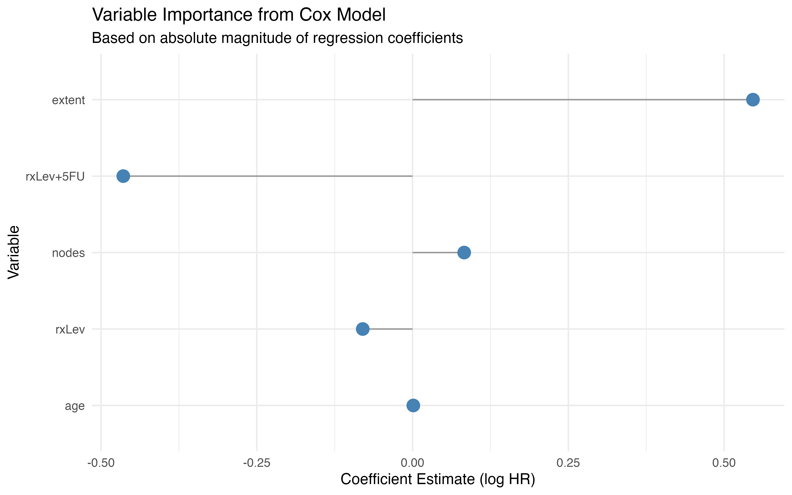
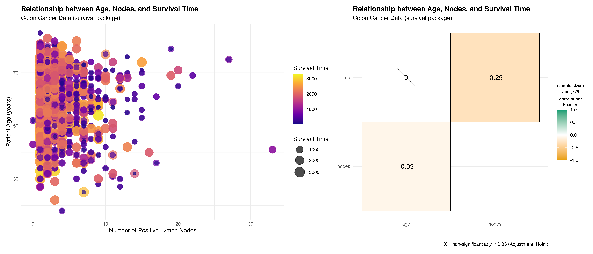

# 🧠 Clinical Visualization in Oncology (Colon Cancer Survival Analysis)

## 📌 Overview

This project presents a **high-resolution clinical visualization framework** applied to the `colon` dataset from the R `survival` package. The goal is to transform complex clinical trial data into **interpretable, publication-grade statistical visualizations** that support evidence-based oncology research.

The analysis focuses on **survival outcomes, treatment effects, and prognostic factors** using a combination of:

- Survival analysis (Kaplan–Meier estimation)
- Cox proportional hazards modeling
- Cumulative incidence functions
- Multivariate exploratory data analysis
- Predictive variable importance assessment

This work emphasizes **statistical rigor, reproducibility, and visual communication**, aligning with standards used in advanced biostatistics and computational oncology research.

---

## 🎯 Scientific Objective

To investigate how treatment allocation and clinical covariates influence survival outcomes in colon cancer patients, and to express these relationships through **interpretable statistical graphics** suitable for translational research.

---

## 🧬 Dataset

- **Source:** `survival::colon`
- **Study Type:** Randomized clinical trial
- **Population:** Patients with resected colon cancer
- **Outcome Variables:**
  - Time-to-event (days)
  - Status (recurrence, death, censored)
- **Covariates:**
  - Treatment group
  - Age
  - Sex
  - Tumor characteristics
  - Lymph node involvement

---

## 🧠 Analytical Framework

The project follows a structured biostatistical pipeline:

1. Data preprocessing and clinical variable harmonization  
2. Baseline demographic and treatment balance assessment  
3. Cox proportional hazards modeling  
4. Kaplan–Meier survival estimation  
5. Cumulative incidence (event probability) analysis  
6. Multivariate prognostic visualization  
7. Correlation and exploratory data analysis  

---

# 📊 Key Visualizations

---

## 👥 Baseline Characteristics: Treatment Balance

  

### Interpretation

Treatment allocation is well-balanced across sex strata, indicating effective randomization. This ensures that downstream survival comparisons are not confounded by sex-based allocation bias.

---

## ⚖️ Cox Proportional Hazards Model (Forest Plot)

  

### Interpretation

- Combination therapy (Lev+5FU) significantly improves survival outcomes  
- Disease extent and lymph node involvement are strong adverse prognostic factors  
- Age and single-agent therapy show limited predictive influence  

This confirms that **tumor burden and combination chemotherapy dominate survival risk structure**.

---

## 📈 Kaplan–Meier Survival Curves

  

### Interpretation

- No meaningful survival difference between male and female patients  
- Strong separation between treatment arms  
- Lev+5FU demonstrates the highest survival probability over time  

This supports the **clinical superiority of combination chemotherapy**.

---

## 📉 Cumulative Incidence Analysis

  

### Interpretation

- Event risk is lowest in the Lev+5FU group  
- Observation group shows the highest cumulative event probability  
- Sex does not significantly influence event accumulation  

This reinforces treatment-driven differences in disease progression.

---

## 🧠 Cox Model Variable Importance

  

### Interpretation

- Lymph node involvement is the strongest risk factor  
- Tumor extent significantly increases hazard  
- Combination therapy reduces hazard (protective effect)  

This provides a **ranked view of prognostic influence in survival modeling**.

---

## 🔬 Exploratory Data Analysis

  

### Interpretation

- Weak correlation between age and survival  
- Moderate negative association between lymph nodes and survival time  
- Heterogeneous survival distribution across clinical profiles  

This supports the need for **multivariate modeling rather than univariate inference**.

---

# 🧠 Key Scientific Findings

- Combination chemotherapy (Lev+5FU) significantly improves survival outcomes  
- Tumor burden (nodes, extent) is the dominant prognostic driver  
- Sex has no statistically meaningful impact on survival  
- Survival dynamics are nonlinear and require multivariate modeling  
- Visual analytics strongly enhances interpretability of clinical models  

---

# ⚠️ Methodological Considerations

- Observational structure within clinical trial framework  
- Limited covariate space  
- Potential unmeasured confounding  
- Classical Cox assumptions apply (proportional hazards)

---

# 🚀 Scientific Contribution

This project demonstrates how **statistical visualization can function as a primary analytical tool**, not just a reporting mechanism, in clinical oncology research.

It bridges:

- Biostatistics  
- Survival modeling  
- Data visualization  
- Clinical interpretation  

---

# 👨‍⚕️ Author

**Daniel Oluwafemi Olofin**  
Computational Biostatistics | Machine Learning in Healthcare | Computational Oncology  

- GitHub: https://github.com/Olofin98  
- Portfolio: https://olofin98.github.io/Daniel.github.io  

> “In modern biostatistics, the clarity of inference is as important as the correctness of computation.”
